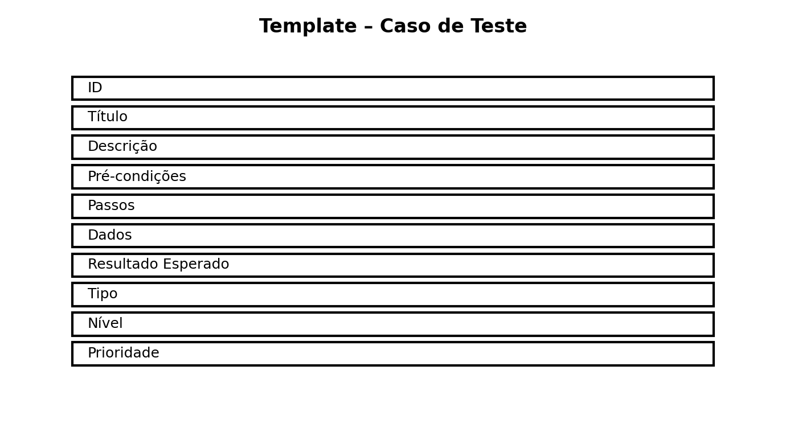
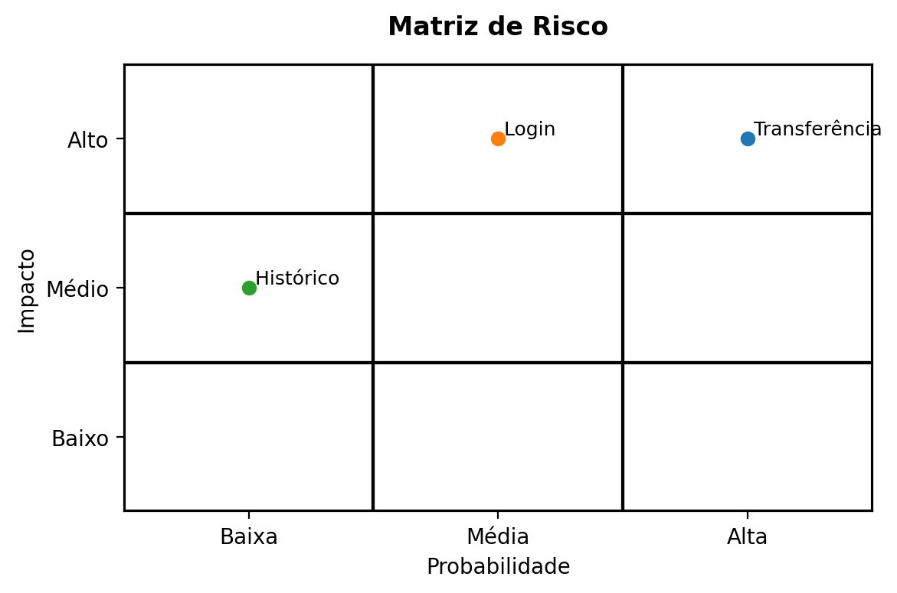
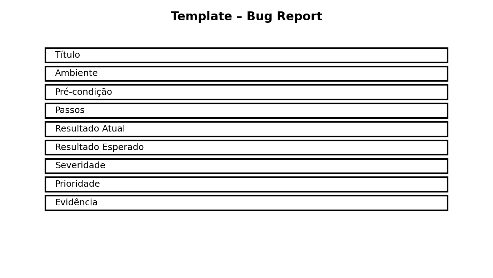
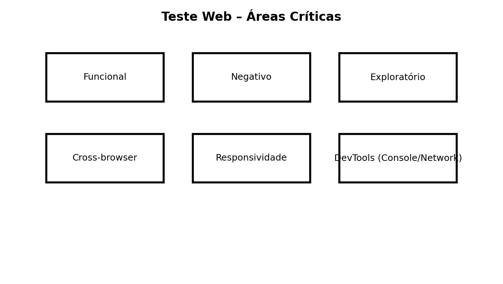
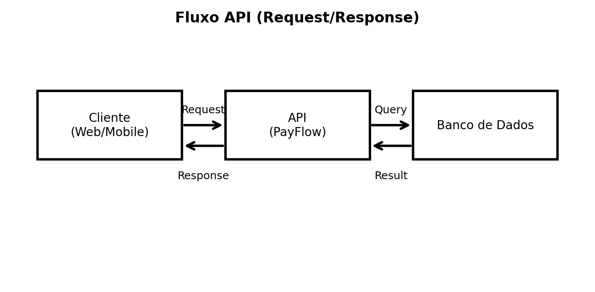
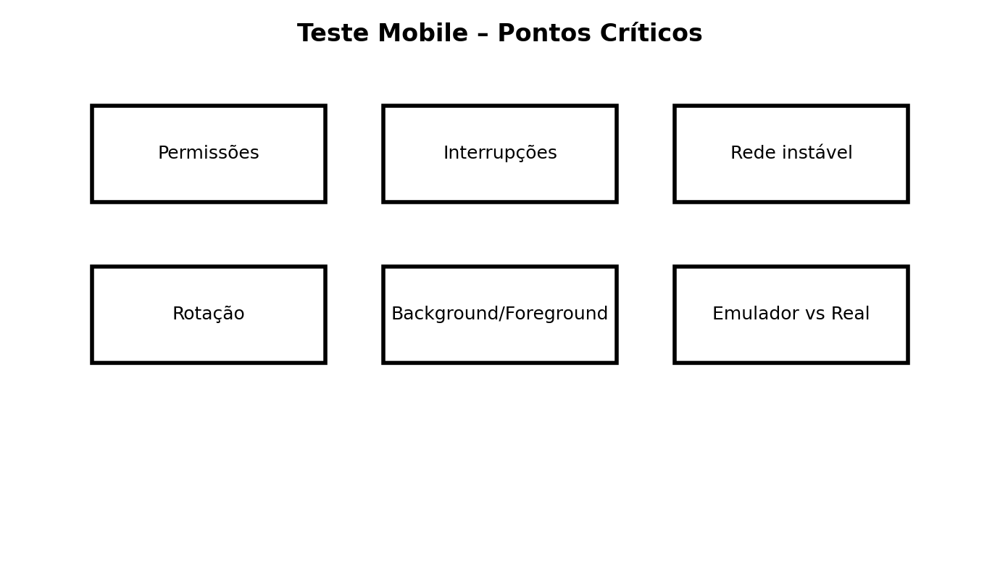

# 🎓 QA Training (Programa Interno) – Guia Completo


> Este README é o **guia principal** do repositório.  
> **Como usar:** clique no índice → navegue pelos módulos → use templates/checklists → execute exercícios.

---

## 📌 Índice (navegação)

1. [Introdução ao Programa](#1-introdução-ao-programa)
2. [Produto Fictício – PayFlow](#2-produto-fictício--payflow)
3. [Módulo 1 – Fundamentos de Qualidade de Software](#3-módulo-1--fundamentos-de-qualidade-de-software)
4. [Módulo 2 – Tipos de Teste vs Níveis de Teste](#4-módulo-2--tipos-de-teste-vs-níveis-de-teste)
5. [Módulo 3 – Estratégias de Teste & Pirâmide](#5-módulo-3--estratégias-de-teste--pirâmide)
6. [Módulo 4 – Leitura de Requisitos & Negócio](#6-módulo-4--leitura-de-requisitos--negócio)
7. [Módulo 5 – Casos de Teste & Técnicas](#7-módulo-5--casos-de-teste--técnicas)
8. [Módulo 6 – Planejamento & Plano de Testes](#8-módulo-6--planejamento--plano-de-testes)
9. [Módulo 7 – Gestão de Riscos & Priorização](#9-módulo-7--gestão-de-riscos--priorização)
10. [Módulo 8 – Reporte Profissional de Bugs](#10-módulo-8--reporte-profissional-de-bugs)
11. [Módulo 9 – Testes Web](#11-módulo-9--testes-web)
12. [Módulo 10 – Testes de API](#12-módulo-10--testes-de-api)
13. [Módulo 11 – Testes Mobile](#13-módulo-11--testes-mobile)
14. [Módulo 12 – Introdução à Automação](#14-módulo-12--introdução-à-automação)
15. [Módulo 13 – Ferramentas de Mercado](#15-módulo-13--ferramentas-de-mercado)
16. [Módulo 14 – QA Júnior Pronta para o Mercado](#16-módulo-14--qa-júnior-pronta-para-o-mercado)
17. [Templates Oficiais](#17-templates-oficiais)
18. [Checklists](#18-checklists)
19. [Exercícios Práticos](#19-exercícios-práticos)
20. [Trilha 30/60/90](#20-trilha-306090)
21. [Arquivos do repositório](#21-arquivos-do-repositório)

---


---

## 🧭 Navegação Rápida (Cards)

| Módulo | Tema | Link |
|---|---|---|
| 1 | Fundamentos | [Ir](#3-módulo-1--fundamentos-de-qualidade-de-software) |
| 2 | Tipos vs Níveis | [Ir](#4-módulo-2--tipos-de-teste-vs-níveis-de-teste) |
| 3 | Estratégia & Pirâmide | [Ir](#5-módulo-3--estratégias-de-teste--pirâmide) |
| 4 | Requisitos | [Ir](#6-módulo-4--leitura-de-requisitos--negócio) |
| 5 | Casos de Teste | [Ir](#7-módulo-5--casos-de-teste--técnicas) |
| 6 | Planejamento | [Ir](#8-módulo-6--planejamento--plano-de-testes) |
| 7 | Riscos | [Ir](#9-módulo-7--gestão-de-riscos--priorização) |
| 8 | Bugs | [Ir](#10-módulo-8--reporte-profissional-de-bugs) |
| 9 | Web | [Ir](#11-módulo-9--testes-web) |
| 10 | API | [Ir](#12-módulo-10--testes-de-api) |
| 11 | Mobile | [Ir](#13-módulo-11--testes-mobile) |
| 12 | Automação | [Ir](#14-módulo-12--introdução-à-automação) |
| 13 | Ferramentas | [Ir](#15-módulo-13--ferramentas-de-mercado) |
| 14 | Mercado | [Ir](#16-módulo-14--qa-júnior-pronta-para-o-mercado) |
## 🗂 Estrutura do repositório

```text
qa-training/
├── README.md
├── manual/
│   └── qa_manual.md
├── pdf/
│   └── qa_manual.pdf
├── images/
│   ├── piramide_testes.png
│   ├── matriz_risco.png
│   ├── fluxo_api.png
│   ├── pipeline_cicd.png
│   ├── teste_web_areas.png
│   ├── teste_mobile_pontos.png
│   ├── template_bug.png
│   └── template_caso_teste.png
├── templates/
├── checklists/
└── exercises/
```

---


## 1) Introdução ao Programa

**Objetivo:** formar uma QA Júnior pronta para o mercado, com base sólida, pensamento crítico e prática em Web, API e Mobile.

**O que este programa entrega:**
- Fundamentos e mentalidade de QA
- Tipos e níveis de teste
- Estratégia e priorização por risco
- Casos de teste, plano de testes e bug report profissionais
- Testes Web / API / Mobile
- Base de automação e CI/CD (conceitos)
- Templates, checklists, exercícios e trilha 30/60/90

---

## 2) Produto Fictício – PayFlow

**PayFlow**: app de pagamentos e controle financeiro (Web + API + Mobile) com:
- Login
- Carteira (saldo)
- Transferência entre usuários
- Histórico de transações
- Notificações

---

## 3) Módulo 1 – Fundamentos de Qualidade de Software

[⬆️ Voltar ao índice](#índice-navegação)


**Objetivo:** entender o que é qualidade, o que é QA e como QA atua em um time.

**O que a Julia deve sair sabendo fazer:**
- Explicar QA vs Teste
- Pensar como usuário, sistema e negócio
- Fazer perguntas úteis no refinamento

**Exercício sugerido:**
- Listar 5 exemplos de “qualidade” em um app real e justificar.

---

## 4) Módulo 2 – Tipos de Teste vs Níveis de Teste

[⬆️ Voltar ao índice](#índice-navegação)


**Objetivo:** diferenciar *tipo* (o que validar) de *nível* (onde validar).

**Tabela rápida:**
- Tipos: funcional, regressão, smoke, sanidade, exploratório, usabilidade, segurança, performance
- Níveis: unitário, integração, sistema, aceitação (UAT)

**Exercício:**
- Classificar 10 cenários do PayFlow em tipo + nível.

---

## 5) Módulo 3 – Estratégias de Teste & Pirâmide

[⬆️ Voltar ao índice](#índice-navegação)


**Objetivo:** saber planejar como testar e onde focar.

**Regra prática:**
- Automatizar mais em API/integração do que em UI.
- UI é importante, mas frágil e cara.

**Ferramentas (exemplos de mercado):**
- API: Postman/Newman
- Web: Cypress/Playwright
- Mobile: Appium
- CI: GitHub Actions/Jenkins

---

## 6) Módulo 4 – Leitura de Requisitos & Negócio

[⬆️ Voltar ao índice](#índice-navegação)


**Objetivo:** transformar requisito em cenários e testes.

**Pontos essenciais:**
- Regras explícitas vs implícitas
- Ambiguidade (não assumir)
- Perguntas de QA que evitam bugs caros

**Exercício:**
- Dada uma user story de transferência, listar 10 perguntas + 5 cenários.

---

## 7) Módulo 5 – Casos de Teste & Técnicas

### 🔗 Materiais Relacionados
- 📄 Template Caso de Teste: `templates/caso_de_teste.md`
- 🐞 Template Bug Report: `templates/bug_report.md`
- 📋 Checklist Casos: `checklists/caso_de_teste_checklist.md`
- 🧪 Exercícios: `exercises/payflow_exercises.md`


[⬆️ Voltar ao índice](#índice-navegação)




**Objetivo:** escrever casos de teste profissionais e aplicáveis.

**Técnicas:**
- Particionamento de equivalência
- Boundary value analysis
- Tabela de decisão

**Exercício:**
- Criar 6 casos de teste para transferência (3 positivos, 3 negativos).

---

## 8) Módulo 6 – Planejamento & Plano de Testes

[⬆️ Voltar ao índice](#índice-navegação)


**Objetivo:** criar um plano realista com escopo, estratégia, riscos e critérios de entrada/saída.

**Exercício:**
- Criar plano resumido para “Transferência PayFlow”.

---

## 9) Módulo 7 – Gestão de Riscos & Priorização

[⬆️ Voltar ao índice](#índice-navegação)




**Objetivo:** priorizar testes quando o tempo é curto.

**Exercício:**
- Montar matriz probabilidade x impacto com 8 itens do PayFlow.

---

## 10) Módulo 8 – Reporte Profissional de Bugs

[⬆️ Voltar ao índice](#índice-navegação)




**Objetivo:** reportar bugs que são corrigidos (não ignorados).

**Pontos essenciais:**
- Passos reproduzíveis
- Evidência
- Resultado atual vs esperado
- Severidade ≠ Prioridade

---

## 11) Módulo 9 – Testes Web

[⬆️ Voltar ao índice](#índice-navegação)




**Objetivo:** testar Web com visão real (fluxo + browsers + responsividade + DevTools).

---

## 12) Módulo 10 – Testes de API

[⬆️ Voltar ao índice](#índice-navegação)




**Objetivo:** validar regra sem UI: status codes, payload, contrato, negativos.

---

## 13) Módulo 11 – Testes Mobile

[⬆️ Voltar ao índice](#índice-navegação)




**Objetivo:** testar Android/iOS com rede, permissões, interrupções, lifecycle.

---

## 14) Módulo 12 – Introdução à Automação

[⬆️ Voltar ao índice](#índice-navegação)


**Objetivo:** entender quando automatizar e por quê (sem automatizar “por automatizar”).

---

## 15) Módulo 13 – Ferramentas de Mercado

[⬆️ Voltar ao índice](#índice-navegação)


**Stack mínima recomendada (QA Júnior):**
- Jira + Confluence
- Postman
- Cypress ou Playwright
- Conceito de CI/CD

---

## 16) Módulo 14 – QA Júnior Pronta para o Mercado

[⬆️ Voltar ao índice](#índice-navegação)


**Checklist final de competência:**
- Cria casos de teste
- Reporta bugs bem
- Testa Web/API/Mobile
- Prioriza por risco
- Comunica com clareza

---

## 17) Templates Oficiais

- Caso de teste: `templates/caso_de_teste.md`
- Bug report: `templates/bug_report.md`
- Plano de testes: `templates/plano_de_testes.md`

---

## 18) Checklists

- Caso de teste: `checklists/caso_de_teste_checklist.md`
- Bug report: `checklists/bug_report_checklist.md`

---

## 19) Exercícios Práticos

- `exercises/payflow_exercises.md`

---

## 20) Trilha 30/60/90

- 0–30: fundamentos, casos de teste e bugs
- 31–60: planejamento, risco, API e mobile
- 61–90: automação introdutória e visão de mercado

---

## 21) Arquivos do repositório

- Manual em Markdown: `manual/qa_manual.md`
- Manual em PDF: `pdf/qa_manual.pdf`
- Imagens do README: `images/`